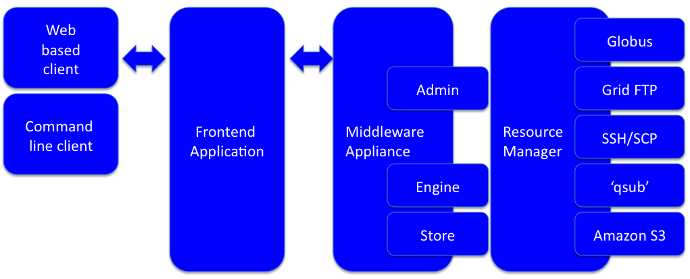

.. _about:

About Yabi
===========
Yabi is a 3-tier application stack to provide users with an intuitive, easy to use, 
abstraction of compute and data environments. Developed at the 
`Centre for Comparative Genomics <http://ccg.murdoch.edu.au>`_, Yabi has been deployed across a diverse set 
of scientific disciplines and high performance computing environments.

Key features
------------

Yabi has a few key features:

 - simplified web based access to High Performance Computing
 - easy tool addition and maintenance
 - handling of disparate compute and storage resouces ie PBSPro, Globus, GridFTP, SSH, Amazon S3
 - easy and powerful workflow creation environment

.. index::
    single: yabi; history
    single: Centre for Comparative Genomics

A brief history
---------------

The Centre for Comparative Genomics has been addressing the problem of facilitating transparent access to HPC for over a decade. As technologies have advanced we have gone
through various iterations to address this issue. Now we have drawn on our experience in HPC and Internet based solutions to produce Yabi, an intuitive abstraction of compute
and data environments.

.. index::
    single: yabi; architecture

Architecture
------------

The diagram below is an overview of the Yabi architecture. There are three main components:
 * The Client (typically a web browser)
 * The Yabi Application
 * The Yabi Backend (Yabi Resouce Manager)

Theses are explained below in more detail.

Client
^^^^^^

The client is typically a web browser, although a command line client also exists (yabish). The command line client interacts 
with the front end application in the same way as a web browser, that is:

 * cookies are used to maintain a user session
 * all traffic is via HTTPS
 * users are required to log in to activate a session

.. index::
   single: yabi; application

Yabi Application
^^^^^^^^^^^^^^^^

The Yabi application is a Python web application running under Apache 2 via mod_wsgi. HTTP and HTTPS are required, although the application 
will insist on HTTPS and redirect any HTTP requests to HTTPS. The application runs under Apache using mod_wsgi so does not require any additional accounts, privileges or ports to be created/opened.

The Yabi application is intended to be run on an Internet facing server as it serves the HTML/CSS/Javascript application that users typically interact 
with as well as a REST style interface for the command line client. Naturally, it can be deployed on an 
internal network if access over the Internet is not desired. 

.. index::
   single: yabi; backend

Yabi Backend
^^^^^^^^^^^^

Yabi Backend is a backend server daemon written in which makes use of the Twisted  Python networking stack. It runs as a dedicated non-root user 
and is **not** intended to be network accessible by users.

The Yabi Backend server is responsible for the communication with individual data and compute resources.

Licence
-------
GNU GPL v3 for non-commercial use only. Please contact the Centre for Comparative Genomics if you require a licence other than GPL for legal or commercial reasons.

Authors
-------
Yabi is developed at the `Center for Comparative Genomics <http://ccg.murdoch.edu.au>`_ at `Murdoch University <http://www.murdoch.edu.au>`_ under the direction 
of Professor Matthew Bellgard. Developers working on the project are Adam Hunter, Andrew Macgregor, Crispin Wellington and Tamas Szabo.

Acknowledgements
----------------
We would like to acknowledge the valuable contributions from the following groups and individuals:

 - Dr Paula Moolhuijzen, Adam Harvey, Nick Takayama, David Schibeci, Mark O'Shea and Brett Chapman, Centre for Comparative Genomics (CCG).
 - Dr Cas Simons, Pierre-Alain Chaumeil, Nick Rhodes, Queensland Facility for Advanced Bioinformatics (QFAB)
 - Professor Andreas Wicenec, Research Associate Professor Kevin Vinsen, International Centre for Radio Astronomy Research (ICRAR)
 - Australian Research Collaboration Service
 - Australian National Data Service
 - Bioplatforms Australia
 - National Collaborative Research Infrastructure Strategy Program
 - Education Investment Fund Super Science Initiative
 - iVEC
